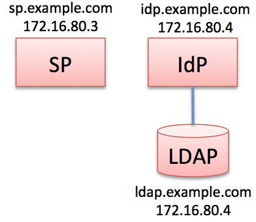

#  Buildtool: An IdP-Installer Shibboleth v3 Test Environment

Using the latest [IdP-Installer](https://github.com/canariecaf/idp-installer-CAF/tree/3.0.0-CAF-RC6) this build tool allows you to rapidly deploy a fully functional self contained Shibboleth IdP connecting to it's own local LDAP server and also installs a test SP.


## VM Architecture



Installation consists of:
- A local private network 172.16.80.0/24 for our hosts
- Automatic updates to your /etc/hosts for:
  - ldap.example.com (172.16.80.2) - LDAP server using openLDAP port 389,636
  - sp.example.com (172.16.80.3)   - Apache2 port 80,443 with mod_shib
  - idp.example.com (172.16.80.4)  - Shibboleth IdP v3, port 443 and connects to LDAP over port 636


URL to invoke to test sign on in your browser (after installation):
- https://sp.example.com/

Example users / passwords to use: 
  - alice / wonderland
  - bob / wonderland 

## How this works
There are three main steps:

1. Prepare you host system (mac/pc/linux) to have the right Vagrant components.
1. Bootstrap some preliminary configuration for said components.
1. Provision the machines.

Once machines are provisioned you can tweak things by ssh'ing into them (vagrant ssh [ldap|idp|sp]) or even manually destroying and reprovisioning one. The script ``provision.sh`` does this work if you would like to peek under the hood.


# Preparing your system
## Required Software Tools

Common to Mac and Linux:

1. Install Vagrant (min ver 1.8.1): https://www.vagrantup.com/downloads.html
1. Install VirtualBox: https://www.virtualbox.org/
1. Install Git client: https://desktop.github.com/

Windows Specific:
:exclamation: Windows will work but you need to do three key things:

> 1. Make sure your BIOS on your machine supports virtualization on your 64 bit architecture.
> 1. Ensure you set git to check things out unchanged for line endings.
> 1. use git bash from windows (start menu -> type in 'git bash' and run everything from there)
> Optional:
>  - The windows alerts that the scripts are changing things can be removed, just click learn more on the dialog when you next see it.
>
>Cygwin has been tried and **SHOULD** work but git-bash from the windows client is the only one I've tested end to end successfully.
>If you use Cygwin be sure to have these packages added when you install (you need to add them explicitly during install BTW)
> - git - git client 
> - curl - http client
> - unzip - client to unzip items

# Getting Started

:exclamation: If on Windows, two extra pre-flight steps are required:

1. Use git bash as your shell
  * Since you installed git for windows, you need to go to the start menu and type 'git bash'
1. UPDATE git config to use NON WINDOWS line feed endings
If you do not, the bash scripts will choke.
have this setting in place before running *any* git commands:

```
git config --global core.autocrlf input
```


## Fetch this repository
Git clone this repository to your machine:
```
git clone https://github.com/canariecaf/idp-installer-buildtools
```

## Preparing Your Environment 

**RUN ONCE PER HOST:** 

Execute script to install vagrant hostmanager plugin which also modifies the `sudoers` file of your host to grant vagrant/hostmanager access to dynamically manipulate the `hosts` file on your host.

```
    $ ./install-vagrant-plugins.sh
````

 **RUN ONCE PER CLEAN PROJECT:** 

Execute bootstrap script to stage sources needed in the SP and IdP build.

```
    $ ./bootstrap.sh
```

## Performing the Provisioning step

Run script to provision all machines - ldap, sp, idp, in that order.

```
    $ ./provision.sh
```

## Verify the installation completed 
Note that any web access requires accepting self signed certificates which are dynamically created each time.

### Verifying the IdP 
You can verify things by checking the idp status page here in your browser. 
```
https://idp.example.com/idp/status
```
### Verifying the SP
Visit the webpage: 
```
https://sp.example.com/
```
### Verifying LDAP
Visit the SP and sign into the services successfully

## FAQ / Tips and Tricks

### Common commands - halt, suspend, resume
typical vagrant commands of halt and suspend work fine:

e.g.
stop all containers:
```
vagrant suspend
```
stop a given container (our example is the idp, but can be sp, or ldap):
```
vagrant suspend idp
```
resume a given container :exclamation: you need to use --no-provision otherwise the container will try to provision again

```
vagrant resume idp --no-provision
```


